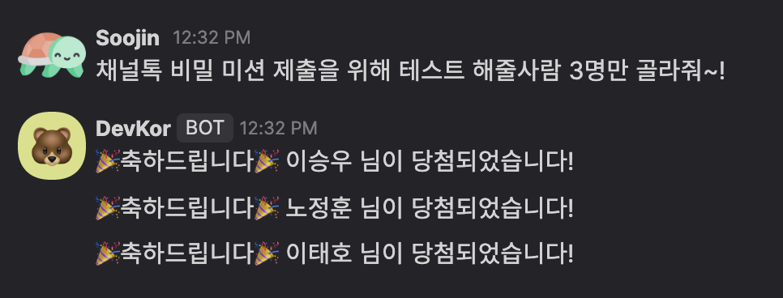
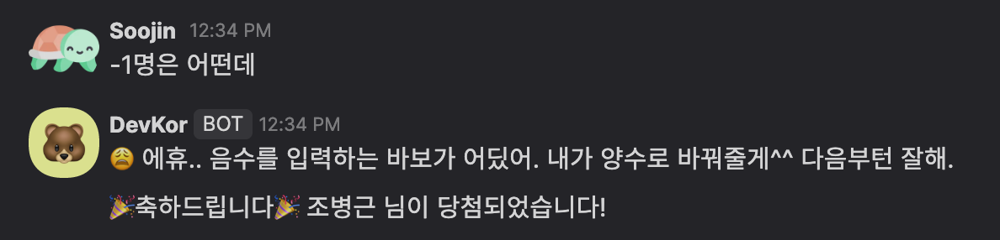
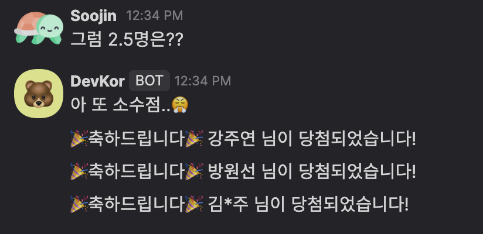
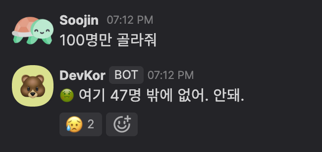
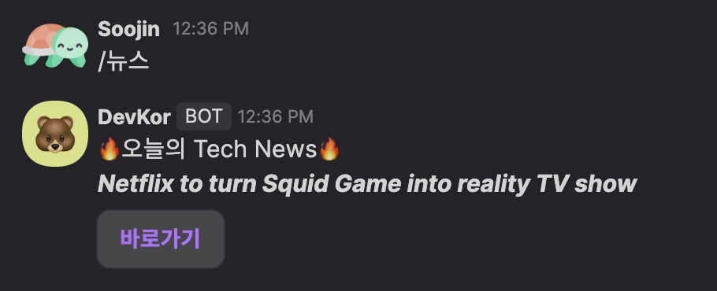

# Summary

Channel Open Api 와 Webhook을 사용하여 TeamChat에서 유용하게 사용할만한 여러가지 기능을 구현하였습니다.  
- Random Selection 기능
- Stop 기능
- News 기능

***
## Random Selection 기능
```
스터디에서 발표할 사람 한명 고르고 싶은데.. 네이버 사다리타기 하러 가기에는 너무 귀찮고, 그렇다고 아무나 지목하기에는 좀 그렇고,, 간편하게 제비뽑기 해줄 만한 거 어디 없나요?ㅠㅠ 
🎉 그래서 준비했습니다! 메세지창에 원하는 인원수를 입력하면 DevKor 봇이 친절히 골라줄 것입니다!
```
<b>Keyword</b> : ` 명 `    
"명"이 포함된 메세지를 TeamChat의 채널에 입력하면, 해당 Group 내에서 입력한 명수만큼 중복없이 랜덤으로 골라줍니다.


### Examples

<br />
<br />


<br />
<br />


음수를 입력한 경우, 양수로 변환 후 골라줍니다.
<br />
<br />

소수점을 입력한 경우, 올림을 하고 마지막 인원에 대해서는 이름의 절반만 보여줍니다.
<br />
<br />
  
해당 GroupChat의 인원수보다 많은 수를 입력하면, 에러 메세지를 띄워줍니다.

***
## Stop 기능 
```
예외 처리 안한 채로 봇 개발하고 뎁코 잡담 채널에 테스트를 부탁했더니..
"100명만 골라줘" 등등 자체적으로 스트레스 테스트를 해주더라구요.. 너무 당황한 나머지 서버를 종료 시켜려고 커맨드 창을 켜고 명령어를 입력하고.. 서버가 종료되는 데까지 시간이 너무 오래걸리더라구요.. 이러한 비상 사태를 효과적으로 대비하는 방법 어디 없나요? ㅠㅠ
🎉 그래서 준비했습니다! 비상 상황에 /멈춰 를 입력하면 DevKor 봇이 서버를 종료시켜줄 것입니다! 다만, 이렇게 두글자로 서버를 종료시키는 것은 다른 문제를 불러일으킬 수 있으니, 남용해서는 안됩니다!!
```
Keyword : `/멈춰`    
급한 상황에 메세지를 통해 서버를 종료시키는 기능입니다.


### Example


***
## News 기능
```
자고 일어나면 새로운 기술이 또 등장해있는 현대 사회에서 개발자로서 매일 Tech 뉴스를 보면서 팔로우업해야 되지 않을까요?
🎉 그래서 준비했습니다! 매일 아침마다 DevKor 봇이 그날의 메인 Tech뉴스를 보여줄 것입니다!
```
Keyword : `/뉴스`     
평일 오전 9시마다 BBC Tech News 의 최상단에 있는 뉴스를 하나 메세지로 전송해줍니다.  
또는 뉴스가 보고 싶다면 "/뉴스" 라고 입력하시면 그 시점에서의 메인 Tech뉴스를 보여줍니다!


### Example

바로가기 버튼을 클릭하면 해당 뉴스기사로 바로 이동합니다.
***


